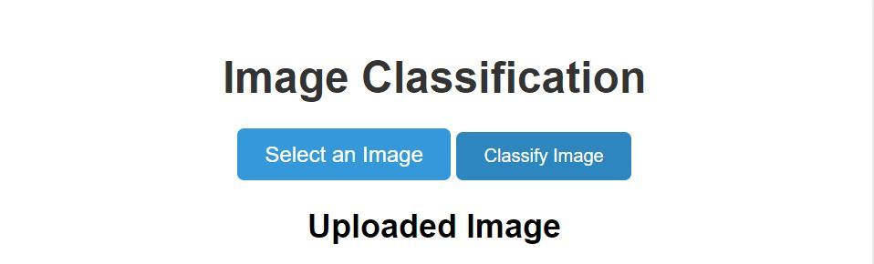
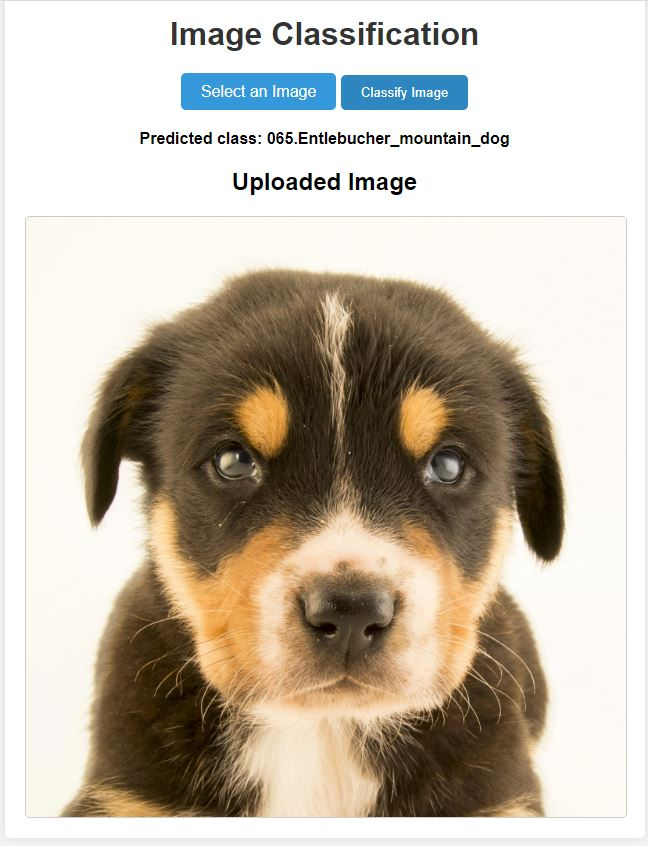
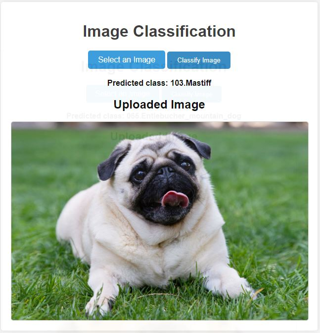
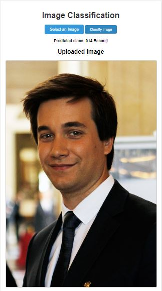
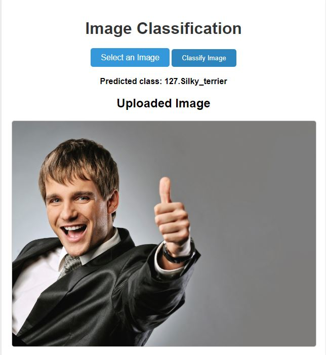
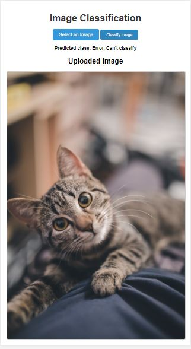
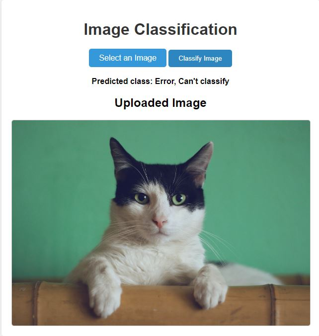

# Dog Breed Classification Web App

# Table of contents

1. [Project Motivation](#project-motivation)
2. [File Description](#file-description)
3. [Run project](#run-project)
4. [Analysis](#analysis)
5. [Result](#result)
6. [Licensing, Authors, Acknowledgements, etc.](#licensing-authors-acknowledgements-etc)

### Project Motivation

In this project, I build an web application that classify the breed of dog. In this application user can upload an image if that image has a dog CNN will classify the breed of dog, if that image contains humnan CNN will classify it as a breed of dog that resemble to that human. If the image neither has dog or human it will output error. This application will be very useful in case you need to classify a breed of dog.

### File Description
```
├── app.py # python script that run flask web server
├── dog_app.ipynb # file jupyternotebook that used to train model and output model weights as well as metric after traning
├── dog_classes.pkl # pickle file contain name breed of dog
├── extract_bottleneck_features.py # python script contain some function to extract some pretrained CNN feature
├── haarcascades
│   └── haarcascade_frontalface_alt.xml # config file to load haarcascades to detect human
├── requirements.txt # contain need packages to run app
├── saved_models
│   └── weights.best.Resnet50.hdf5 # weight of trained model
├── static
│   └── uploads # contain image user has uploaded    
├── templates # contain html file to show ui
│ 
└── utils.py # python script contains some functions
```

### Run project

1. Clone source code from github 

```
git clone 
```

2. Install necessary packages

```
pip install -r requirements.txt
```

3. Train model

If you need to train model from scratch you can open and run all cells in jupyternotebook 'dog_app.ipynb'
Note: You need to run this file in udacity workspace because it contain data for training. After training model weight is saved in 'saved_models\weights.best.Resnet50.hdf5' you can download and replace with this file in this repo

4. Start web app

```
python app.py
```

This app running on http://localhost:5000



Press 'Select an Image' and choose image need to classify then press 'Classify Image'



Image and classify result will show. That images also saved in 'static\uploads' folder

### Analysis

The dataset consists:
There are 133 total dog categories.
There are 8351 total dog images.

There are 6680 training dog images.
There are 835 validation dog images.
There are 836 test dog images

#### Human Dectector
I used haarcascades detector to identify human in image and test detector with 100 human images and 100 dog images

percentage of the first 100 images in human_files have a detected human face:  1.0
percentage of the first 100 images in dog_files have a detected human face:  0.11

#### Dog detector
I used pretrained model ResNet50 from Imagenet dataset to indentify dog in the image and test detector with 100 human images and 100 dog images

percentage of the first 100 images in human_files have a detected dog:  0.0
percentage of the first 100 images in dog_files have a detected dog:  1.0

#### Model Performance
With above dog dataset I train some model to classify dog
1. CNN from scratch has a test performance of 2.39%.
2. fine tune pretrained VGG-16 CNN model has a test accuracy of 47.1292%
3. fine tune pretrained ResNet CNN model has a test accuracy of 81.1005%

So I conclude some results. 
- Finetuning from pretrained model often give better performance in comparison with training model from scratch.
- Use some modern architecture such as Resnet50 also give better performance with old architecture such as VGG16

### Result

Test with dog images 




Test with human images





Test with cat images





### Licensing, Authors, Acknowledgements, etc.
Thanks to Udacity for starter code in jupyternotebook to train model. 